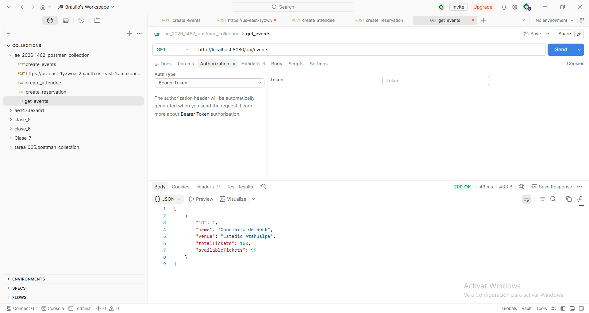
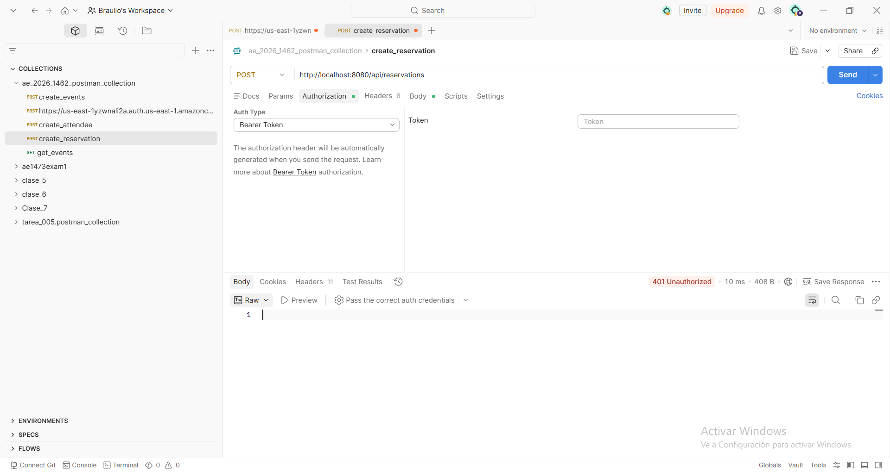
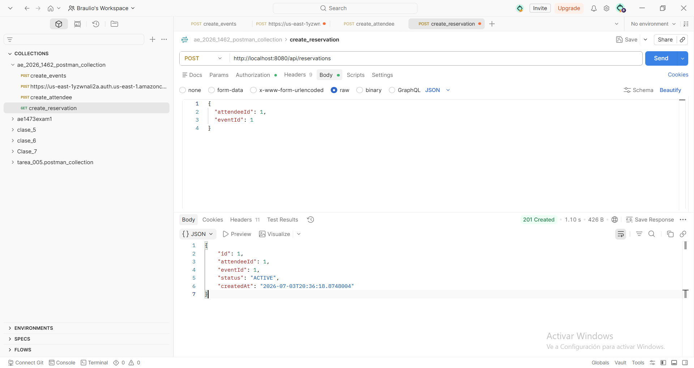
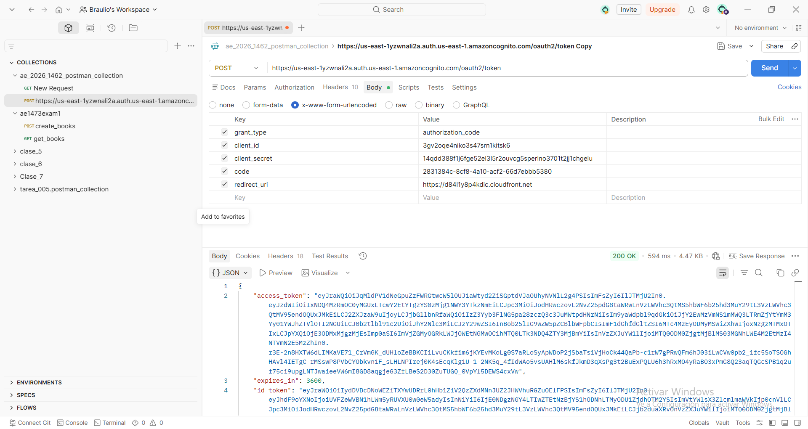
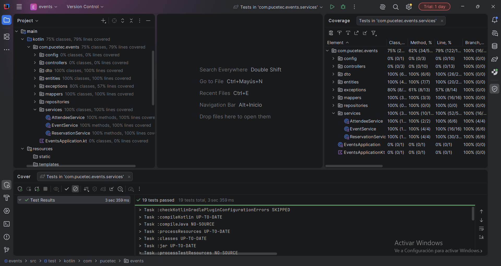

### Evidencias del Entregable

A continuación se adjuntan las capturas correspondientes al funcionamiento del sistema y los requerimientos solicitados en la rúbrica:

### 1. GET /api/events (Público - 200 OK sin token)
Acceso exitoso al catálogo de eventos sin incluir credenciales en la petición HTTP.

### 2. POST /api/reservations (Privado - 401 Unauthorized sin token)
Rechazo inmediato del sistema de seguridad al intentar realizar una reserva de entrada sin enviar un token de Cognito.

### 3. POST /api/reservations (Privado - 201 Created con token válido)
Procesamiento y creación exitosa de la reserva al proveer un `access_token` vigente en las cabeceras de Postman.

### 4. Configuración de AWS Cognito & Postman Hosted UI
Demostración de la configuración del User Pool, App Client y el flujo de Authorization Code ejecutado en Postman para capturar el token.

### 5. Reporte de Cobertura en IntelliJ IDEA (100% Line / 100% Branch)
Captura del panel *Run with Coverage* de IntelliJ donde se valida que la capa de servicios cumple con la totalidad de líneas y ramas del negocio cubiertas.
